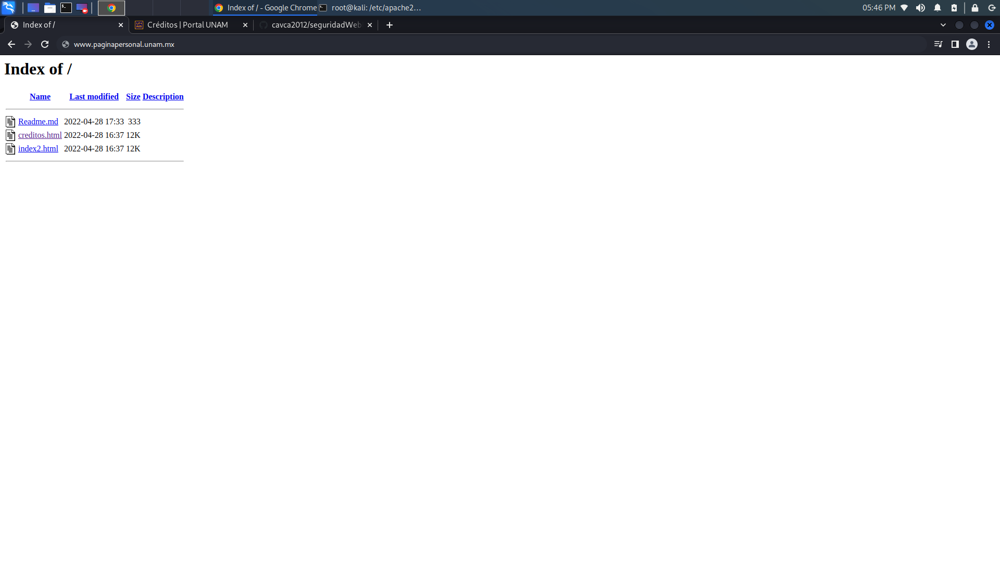
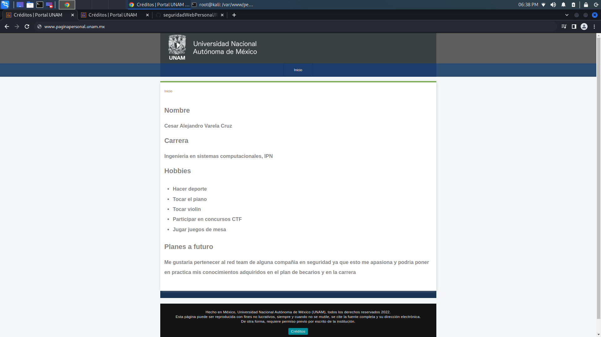
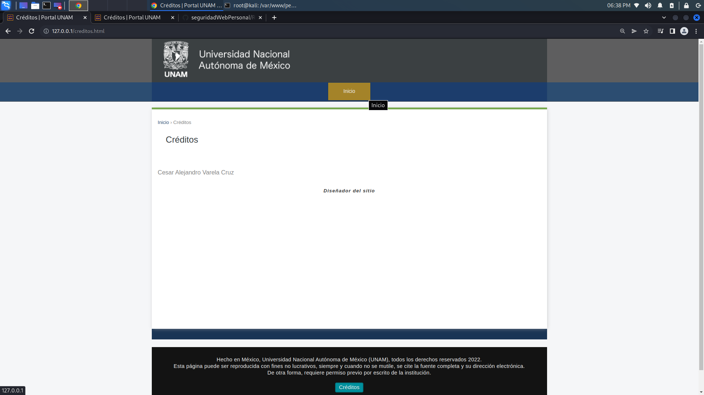

# Ejercicio pagina personal con creditos

## Esta pagina contiene una index con una presentación mía (Cesar Alejandro Varela Cruz) con creditos y los archivos de configuracion de un servidor apache

**¿Que pasa si no se tiene un archivo index.\*?**

En caso de no encontrarse un archivo index.\* se mostrará el arbol del directorio indicado como DocumentRoot 


**¿Cómo indico que home.html debe servirse al solicitar la raiz del sitio?**

 En /etc/apache2/apache2.conf puede agregarse la instrucción:
```DirectoryIndex index.html home.html```

Con esta instrucción se buscaran los archivos en el orden indicado, es decir, se buscara el archivo index.html y de no encontrarse se utilizará el archivo home.html


# Vistas de la pagina web
## index.html


## creditos.html


